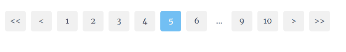

add to reactjs :

```sh

$ npm install @abasb75/paginate --save

```

usage example :


```javascript


import {ABPaginate} from "@abasb75/paginate";

import { useState } from 'react';

import {ABPaginate} from "@abasb75/paginate";

function App() {

  const [activePage,setActivePage] = useState(1);
  const pageRangeDisplayed = 4;

  return (<>
    <h1>page : {activePage}</h1>

    <ABPaginate
      activePage={activePage}
      lastPage={10}
      pageRangeDisplayed={pageRangeDisplayed}
      onChange={setActivePage}

    />
    
  </>
    
    
  );
}

export default App;

```


props :

<!-- props-table-start -->
## Properties

| Property | PropType | Required | Default | Description |
|----------|----------|----------|---------|-------------|
| activePage | `number` |  | `1` |  |
| lastPage | `number` |  | `1` |  |
| pageRangeDisplayed | `number` |  | `4` |  |
| onChange | `func` |  | `()=>{}` |  |
| listClassName | `string` |  | `'ab-paginate-list-2857373'` |  |
| itemClassName | `string` |  | `'ab-paginate-item-1683646'` |  |
| nextClassName | `string` |  | `'ab-paginate-next-1837342'` |  |
| previousClassName | `string` |  | `'ab-paginate-prev-5567886'` |  |
| firstClassName | `string` |  | `'ab-paginate-first-3873878'` |  |
| lastClassName | `string` |  | `'ab-paginate-last-8866568'` |  |
| disabledFirstClassName | `string` |  | `'ab-paginate-dfirst-3203808'` |  |
| disabledLastClassName | `string` |  | `'ab-paginate-dlast-8843780'` |  |
| disabledPreviousClassName | `string` |  | `'ab-paginate-prev-4034800'` |  |
| disabledNextClassName | `string` |  | `'ab-paginate-next-1324686'` |  |
| activeItemClassName | `string` |  | `'ab-paginate-actv-5623876'` |  |
| breakClassName | `string` |  | `'ab-paginate-brek-4343078'` |  |
| showNextPage | `bool` |  | `true` |  |
| showPreviousPage | `bool` |  | `true` |  |
| showFirstPage | `bool` |  | `true` |  |
| showLastPage | `bool` |  | `true` |  |
| nextPageLabel | `string` |  | `'>'` |  |
| previousPageLabel | `string` |  | `'<'` |  |
| firstPageLabel | `string` |  | `'<<'` |  |
| lastPageLabel | `string` |  | `'>>'` |  |
| breakLabel | `string` |  | `'...'` |  |
| buttonRounded | `none` `normal` `quarter` `full` |  | `normal` |  |
| buttonWidth | `number` |  | `42` |  |
| buttonHeight | `buttonHeight` |  | `42` |  |


<!-- props-table-end -->