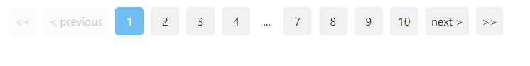

add to reactjs :

```sh

$ npm install @abasb75/paginate --save

```

usage example :


```javascript


import {ABPaginate} from "@abasb75/paginate/dist";

import { useState } from 'react';

function App() {

  const [activePage,setActivePage] = useState(1);
  const pageRangeDisplayed = 4;

  return (<>
    
    <ABPaginate
      activePage={activePage}
      lastPage={10}
      pageRangeDisplayed={pageRangeDisplayed}
      onChange={setActivePage}
    />
    
  </>
    
    
  );
}


```


